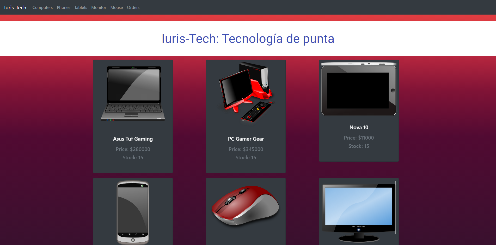

<h1 align="center">Welcome to Iuris-Tech 👋</h1>
<p>
  
  <a href="#" target="_blank">
    
  </a>
</p>

This project was created with the idea of being an E-commerce for electronic items.

We have 6 products in inventory with a stock of 15 items each.

The idea is to classify the categories:

- `Computers`
- `Phones`
- `Etc.`

We will also choose each product to see its details.

Finally, we will upload our purchase to the cart.

### 🏠 [Homepage](https://iuristech.netlify.app/)

### ✨ [Demo](https://iuristech.netlify.app/)

## Screenshot



## Preview


## Install

```sh
npm install
```

## Usage

```sh
npm run start
```

## Dependencies

### * React Js

[react](https://es.reactjs.org/),
[react-dom](https://es.reactjs.org/docs/react-dom.html),
[react-router-dom](https://www.npmjs.com/package/react-router-dom),
[react-scripts](https://www.npmjs.com/package/react-scripts),
[prop-types](https://www.npmjs.com/package/prop-types),

### * Firebase

[firebase](https://firebase.google.com/),

### * Styles

[material-ui](https://material-ui.com/),
[react-bootstrap](https://react-bootstrap.github.io/),
[animate.css](https://animate.style/),
[bootstrap](https://getbootstrap.com/),

### * Linters

[ESLint](https://eslint.org/),
[Prettier](https://prettier.io/),
[lint-staged](https://www.npmjs.com/package/lint-staged/v/7.3.0),
[husky](https://typicode.github.io/husky/#/),
[styled-components](https://styled-components.com/),

## Author

👤 **Luis Mujica**

* Github: [@iuris2k](https://github.com/iuris2k)
* LinkedIn: [@luis-mujica](https://linkedin.com/in/luis-mujica)

## Show your support

Give a ⭐️ if this project helped you!

***
<a rel="license" href="http://creativecommons.org/licenses/by/4.0/"></a><br />This work is licensed under a <a rel="license" href="http://creativecommons.org/licenses/by/4.0/">Creative Commons Attribution 4.0 International License</a>.
